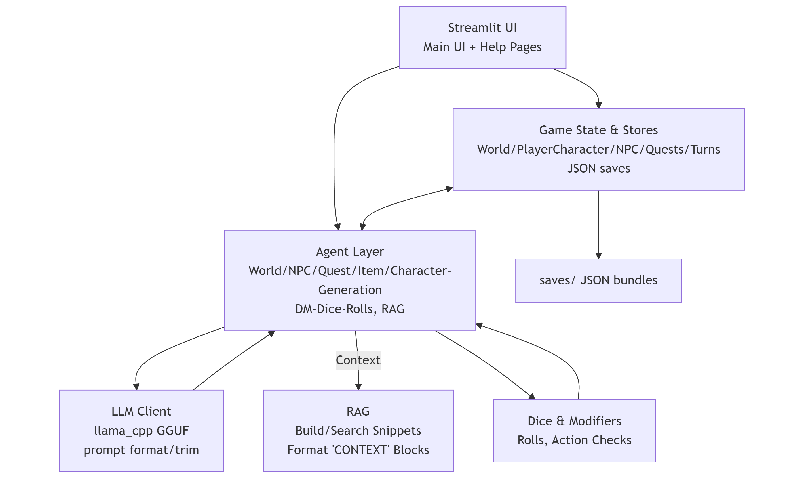

# Local RPG Dungeon Master

This is a table top role playing game dungeon master. It takes care of generation of the World, NPCs, Quests. The DM can generate items for ones inventory such as weapons, armor etc. Dice roll mechanics have been set up which govern specific actions. This project is to showcase the constrained usage of the local llm model, which is being constrained and molded into functioning without causing the common issues notices in quantized local models.

## Game Flow
- To start the game after running the bat file, you will have to enter a Game ID. This will help users sync their session (if you have multiple people connecting over the internet).
- You should write the player using the terminal, this will help set your player's name.
- Frist prompt is world generation. You are free to input whatever, but remember the limitations of the local model you are using. (Not every model can behave like Chat-GPT)
- This starts the generation of the world, then NPC to populate the world and quests.
- Use the character manager button to open the manager. Within it fill the details to generate your character. Recommendation: Try not being too obtuse as the model will just fail in the generation of the item.
- The character gen should be loaded using the button below and then towards the end of the page, click the generate character button. (This was done to prevent the OOM scenario with multiple people trying to generate their characters at the same time. If multiple people use the same terminal it will form a queue and process it FIFO)
- Once character is generated, go back to the main page and click on the "Refresh Party Summary" and then "Build Initiative Order". These two should load your character and assign an initiave so that the LLM knows whose turn is next.
- Start the session with a generic "Lets start" or something similar.
- Make sure to click next turn after every prompt you enter, that moves the game further and helps the llm keep track of the turn.
- Actions such as 'stealth' 'shoot' 'attack' etc have to be performed with "/action I sneak around a guard". If this is not followed, the DM will not be able to run dice throws for the scenario.
- Use the save buttons to save the generated world and other items. These will be saved in a folder called 'saves' in the project directorty. You can use these to continue off from a paused campaign.

## Architecture

## Quickstart
1) Install Python 3.10+ and create a virtualenv.
2) `pip install -r requirements.txt`
3) Place a GGUF model in `model/` and set `model_path` (plus `cpu_threads`, `gpu_layers` if desired) in `src/config.py`.
4) Run: `streamlit run src/UI/streamlit_webapp.py` (or use `run_app.bat` on Windows).
5) In the sidebar: choose a Game ID, add player names, click **Reset Game** if needed, then describe your world to begin.

## Tech stack
- Python, Streamlit, llama-cpp-python.
- Data: JSON saves under `saves/` for worlds, PCs, NPCs, quests, bundles, turn logs.
- Retrieval: keyword search over saved JSON to feed `[CONTEXT]` into DM prompt; history summarization trims chat length.

## Configuration
- Model path: `src/config.py::model_path` (defaults to `model/Meta-Llama-3.1-8B-Instruct-Q6_K_L.gguf` - swap in your own GGUF).
- Performance knobs: `cpu_threads`, `gpu_layers`, `default_temp`, `default_max_tokens`.
- Saves directory: `saves/` (auto-created).

## Repository map
- `src/UI/streamlit_webapp.py` - main app shell.
- `src/UI/pages/` - pages for character manager, quest log, NPC log, world info.
- `src/agent/world_build.py`, `npc_gen.py`, `quest_gen.py` - generation prompts/parsers.
- `src/agent/char_gen.py`, `item_gen.py` - character and item generation.
- `src/game/` - game state, models, dice, save/load.
- `run_app.bat` - convenience launcher for Streamlit + ngrok.

## Troubleshooting
- Model not found: ensure your GGUF file exists and `model_path` points to it.
- GPU layers: set `gpu_layers=0` to stay CPU-only if you hit GPU issues.
- Port conflicts: change the Streamlit port via `streamlit run ... --server.port 8502`.
- Slow responses: lower `default_max_tokens` or increase `cpu_threads` within your hardware limits.

## Tests
- Run locally: `python -m pytest src/tests` (or `src/tests/run_test.bat` on Windows).
- The suite is mostly unit tests with mocks/fixtures; it covers:
  - RAG corpus building, dense/keyword search, and `[CONTEXT]` block formatting.
  - DM context guardrails when no corpus or no hits.
  - Command parsing and action synonym handling.
  - Dice rolling, roll-request parsing, and action-label enforcement.
  - Action modifier calculation and check evaluation.
  - Save/load round trips for world, PCs, NPCs, quests, and initiative.
  - World generation parsing plus prompt formatting/history trimming and summarization behavior.
- Optional local model smoke tests (requires a GGUF model and `RUN_LLM_TESTS=1`):
  `python -m pytest src/tests/test_local_llm_model.py`
- GitHub Actions runs the tests on demand (see badge above).

## For reviewers (In German)
Dieses Projekt entstand als eigenständig entwickeltes Portfolio-Projekt, um lokale LLM-Agenten mit strukturierter Zustandslogik, einfacher RAG-Schicht und einer voll funktionsfähigen Benutzeroberfläche zu demonstrieren. 

Es zeigt insbesondere:
- Trennung von UI, Agentenlogik und Spielzustand
- Nutzung eines lokal laufenden GGUF-Modells (llama-cpp-python)
- Deterministisches, nachvollziehbares Retrieval statt intransparenter Cloud-Aufrufe
- Tests und GitHub Actions für reproduzierbare Änderungen
